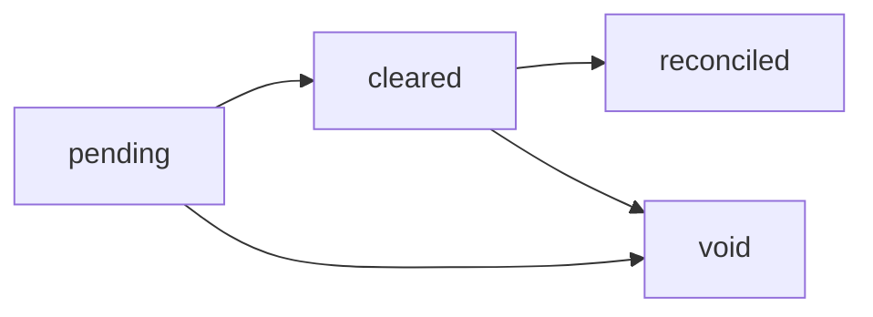

# 📘 Documentación: FinancialRecordStatus & FinancialRecordSource

## 🧭 1. FinancialRecordStatus

El campo **`status`** define el estado del ciclo de vida de cada movimiento financiero registrado en la colección
`financial_records`.

Representa **en qué etapa se encuentra una transacción**, desde su creación hasta su conciliación o anulación.

### 🧩 Valores posibles

| Estado       | Significado                                                                     | Cuándo se usa                                                                    | Impacto contable                                |
|--------------|---------------------------------------------------------------------------------|----------------------------------------------------------------------------------|-------------------------------------------------|
| `pending`    | Movimiento registrado o programado, aún no ejecutado.                           | Creación manual o automática de un compromiso, donación futura o pago pendiente. | No afecta flujo de caja real, solo proyección.  |
| `cleared`    | El pago/ingreso fue realizado internamente pero aún no conciliado con el banco. | Al registrar el comprobante o confirmar ejecución manual.                        | Se incluye en flujo de caja real.               |
| `reconciled` | El movimiento fue confirmado con el extracto bancario o API (Pix/Open Finance). | Proceso de conciliación manual o automática.                                     | Movimiento verificado y cerrado contablemente.  |
| `void`       | Movimiento anulado o revertido.                                                 | Por error, cancelación o reversión (`type = REVERSAL`).                          | No afecta reportes; se mantiene para auditoría. |

### 🔄 Transiciones válidas



**Regla:** No se puede saltar directamente de `pending` a `reconciled`.

### 🧠 Recomendaciones

- Registrar `clearedAt`, `reconciledAt` (timestamps).
- Emitir evento `FinancialRecordStatusChanged` cada vez que cambie el estado.
- En reportes:
    - **DRE**: incluir `cleared` y `reconciled`.
    - **Flujo proyectado**: incluir `pending`.
    - **Auditoría**: incluir todos, incluso `void`.

---

## ⚙️ 2. FinancialRecordSource

El campo **`source`** indica **de dónde proviene** o **quién generó** el registro financiero.
No se refiere al origen del dinero, sino al **origen lógico del dato**.

### 🧩 Enumeración

```ts
export enum FinancialRecordSource {
  MANUAL = "MANUAL",
  AUTO = "AUTO",
  IMPORTED = "IMPORTED",
}
```

### 💬 Descripción

| Valor      | Significado                                       | Ejemplo                                                | Origen                                  |
|------------|---------------------------------------------------|--------------------------------------------------------|-----------------------------------------|
| `MANUAL`   | Creado manualmente por un usuario.                | Registro de diezmo o gasto hecho por el tesorero.      | UI / formulario del sistema.            |
| `AUTO`     | Generado automáticamente por otro módulo interno. | CxP crea el movimiento de pago al aprobar una factura. | Jobs internos o workflows.              |
| `IMPORTED` | Proveniente de integración externa.               | Importación de CSV/OFX, API bancaria o Pix.            | Procesos de integración o importadores. |

### 🧠 Recomendaciones

- Valor por defecto: `MANUAL`.
- Usar en auditorías para distinguir origen humano vs automático.
- Permite controlar duplicados y priorizar conciliaciones externas (`IMPORTED`).

---

## ✅ Ejemplo combinado

```json
{
  "churchId": "iglesia-01",
  "amount": 300,
  "type": "INCOME",
  "method": "cash",
  "status": "cleared",
  "source": "MANUAL",
  "description": "Ofrenda del domingo",
  "createdBy": "usr_10",
  "createdAt": "2025-10-30T21:00:00Z"
}
```
